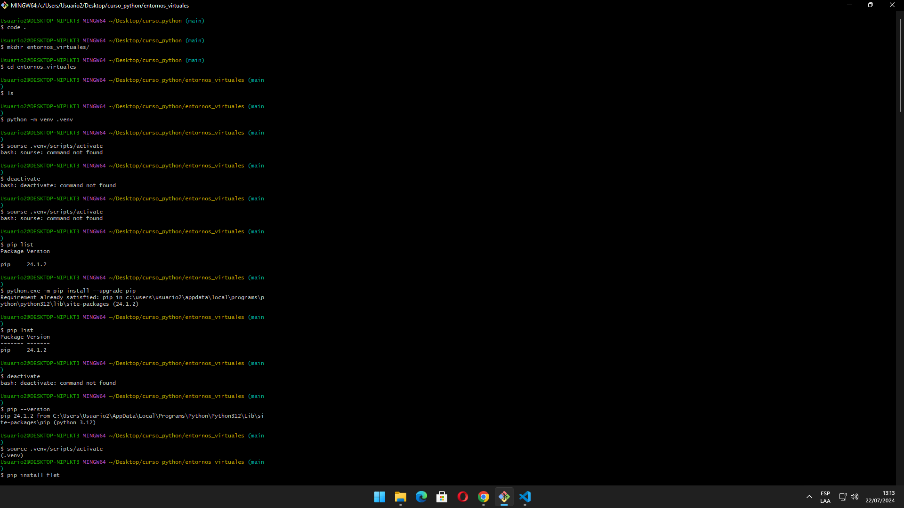
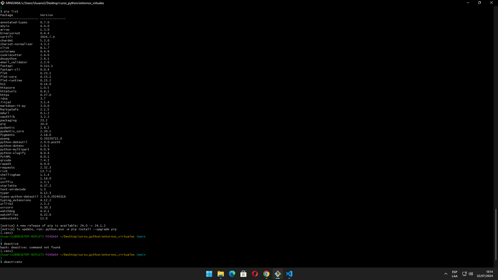

# ENTORNO VIRTUAL EN PYTHON
¿QUE ES?

Son diversos modulos con los cuales python trabaja, en este caso `PIP` es 
como un Play Store, pero en python tenemos diversos paquetes.
## ¿COMO CREAR?
Primero debo ubicarme en la carpeta en la cual creare mi entorno, en este caso me ubico en la carpeta entornos_virtuales. Haremos el proceso medisnte *git bash.*

1. `cd entornos_virtuales/`
2. `ls`
3. `python -m venv .venv` (el `"."` despues del nombre de la sub carpeta es OBLIGATORIO por el acuerdo de convencion, con el "." es que se crea la estructura de carpetas)
4. `source .venv/scripts/activate`  (con este comando se activa y en la parte de abajo del comando aparece `"(.venv)"` o el punto y el nombre que le asignamos)
5. `deactivate`   (con este comando se desactiva pero para instalar los demnas pasos debemos tener el entorno activado)
6. `source .venv/scripts/activate`
7. `pip list` (aparece mas informacion de la cual debemos copiar la letrita verde:`[notice] To update, run: python.exe -m pip install --upgrade pip`)
8. `python.exe -m pip install --upgrade pip`
9. `pip list` si desactivo podre ver la version que tengo, pero veremos que no esta actualizada asi que haremos lo siguiente:
10. 1. `deactivate`
11. 2. `pip --version` aqui mistrarar versiobn anterior
12. 3. `sourse .venv/scripts/activate`
13. 4. `pip --version` aqui ya se actualizara la version de la anterior a la actual
14. `pip install flet`
15. `pip list` haciendo este conmando sabre si se instalo *FLET*

Si queremos eliminar el entorno virtual creado seguidamente ejecutamos estos comandos:

1. `cd ..`
2. `rm -rf entornos_virtuales/`

Si aun no tenemos la carpeta creada hacemos lo siguiente:

1. `mkdir entornos_virtuales/` para crear la carpeta
2. `cd entornos_virtuales` para entrar a la carpeta

> [!TIP]
> *Observacion 1:* si al inicio no se crea la estructura de carpetas automaticas, entonces desintalamos python y lo volvemos a instalar ejecutando todos los pasos y seleccionando todas las opciones
> 
> *Observacion 2:* al finalizar todo el proceso siempre debo deactive para que python nos siga funcionando, basicamente es para prevenir posibles fallas del programa a largo plazo en python

