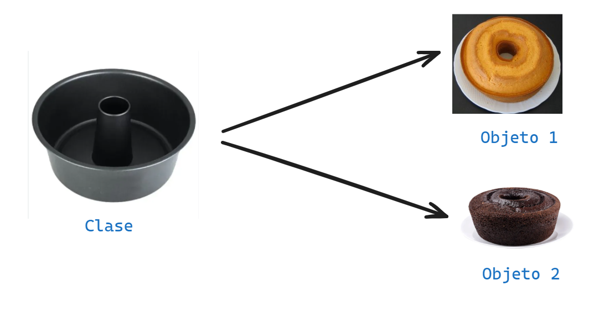
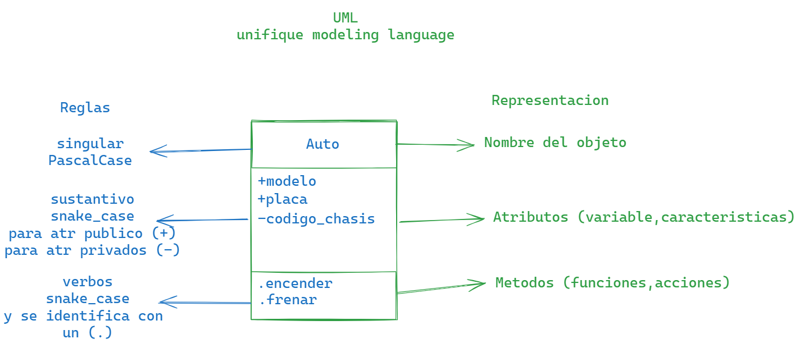

# 🖥️POO - Programacion Orientada a Objetos
La programacion orientada a objetos - `POO` o en sus siglas en ingles `OPP`, es una manera de programar (paradigma*), que permite llevar al codigo  mecanismos usados con `entidades` (las entidades son objetos de la vida real que púede ser descritos).

**Sus beneficios son los siguientes:**
1. Encapsulamiento: permite `encapsular` el codigo dentro de uns unidad (objeto) donde se puede determinar el ambito de actuacion.
   >[!NOTE]
   >ENTIDAD: algo de la vid real que puede ser descrito.
   >OBJETO: el tipo de dato de la cual guardo la informacion de una entidad.
2. Abastraccion: Permite `generalizar` los tipos de objetos a travez de las clases y simplificar el programa.
3. Herencia: Permite `reutilizar` codigo al poder heredar atributos y comportamientos de una clase. (la **clase** es el molde y el **objeto** serian lo que sale del molde o sea un keke).
4. Polimorfismo: permite `crear` multiples objetos a partir de una misma pieza flexible de codigo.
5. existe dos pilares mas que a este nivel que estan mis alumnitos van a morir. existen dos que a nivel educativo no es necesario aprenderlo.
6. Acoplamiento.
7. Cohesion.

## QUE ES UN OBJETO
Un `objeto` es un tipo de dato estructurado que contiene o almacena `datos` y `codigo`.

|Elementos|Que son |Como se llama|Como se identifica |
|---------|--------|-------------|-------------------|
|Dato     |Variable|Atributo     |Mediante sustantivo|
|Codigo   |Funcion |Metodo       |Mediante verbos    |

Un objeto represneta una `instancia unica` de alguna `entidad` a travez de sus atributos e interactua con otros objetos o con si mismo a travez de sus metodos. (cada humano tiene cada **instancia unica**, o sea algo que la diferencia, en cambio la **instancia general** es lgo que todos los humanos tiene en comun, el ser humanos es una instancia general)

## QUE ES UNA CLASE
Para crear un `objeto` primero debemos definir la `clase`
Para responder la preguntya de Alwex debemos pensar en la `clase` del profe del profesor Alvares como el `molde` con el que se ctrean nuevos objetos. 
Es el proceso de diseño de una clase hay que tener en cuenta el `principio de responsabilidad unica`, esto intentando que los `atributos` y los `metodos` esten enfocados en un objetivo unico y bien definido.

>[!TIP]
>**Un paradigma de programacion es un metodo, tecnica o estilo de programar. Muchos de los lenguajes de programacion son creados en base a un paradigma, ejemplo java es un lenguaje que adopta el paradigma POO(Programacion Orienda a Objetos). Sin embargo existen lenguajes de programacion que adoptan varios paradigmas como es el caso de python y javascript estos son lenguajes multiparadigmas.**
## UML
Lenguaje Unificado de Modelado (los objetos son representados por rectamgulos orizontales).
No olvidemos que segun el contexto (donde usare el onjeto) seran sus atributos.

los metodos solo hacen una sola cosa